# キーボード

## まとめ
  - US配列キーボードをWIN環境で使う場合
    - オプションからレイアウト変更を実施する  
    https://enjoypclife.net/2016/10/17/windows-10-us-keyboard-layout-japan-tips/
      - この状態だと、ノートPC本体はJISキーボードでUS配列入力となってしまう。
    - 言語の追加で対応していれば  
    Winキー＋SpaceでUS←→JIS配列の変更ができる
    - CAPSLock or Ctrl+Space or Alt + ` でIMEON/OFFできるが、CapsやAltはオススメしない。
    - nizなら不要なキー(Scroll Lockとか)にCtrl+Spaceを設定することでWindows側の設定を少しの変更で使えるようになる（この程度ならキーボード持ち込み可な出向先であればできるだろう）。
    - ソフト導入可能な場合、alt-ime-ahkを導入することで左右ALTをIMEOn/Offにできる  
    https://github.com/karakaram/alt-ime-ahk/releases
      - またはAutoHotKeyでなんかそれっぽく置換する作戦が良いと思う
    - us配列にした段階で、変換無変換キーは消滅するのでIMEON、IMEOFFのキーをWindows標準ソフトで用意することができない。  
    そのためUS配列ではなくAX配列を使うことで解決できる可能性がある。
  - US配列キーボードをWIN環境で使う場合
    - 方法1：設定＞優先する言語＞日本語のキーボードレイアウトを106/109から101/102に変更＞再起動  
    変更の度に再起動が必要
    - 方法2：設定＞優先する言語＞英語（米語）を追加する  
    CTRL+SPACEでJISとUSを切り替えれるが、日本語が打てるのはJIS配列のみ

## US?JIS?
  - JIS配列
      
    - どの作業場所行っても大体これ  
    調べると、大手になればUSとJISの選択式の所もあるらしい・・  

    - JIS配列キーボードでなるべくUS配列に近づけたい  
    Win側でAX配列に認識させて、ごにょごにょする参考。  
    https://cero-t.hatenadiary.jp/entry/20181125/1543139308  
    https://uchanote.blogspot.com/2015/08/us-ime-onoff.html 
    https://technote.flyingjunk.net/786/   
    https://qiita.com/Big/items/c97573965804fb21ff9e  
    https://answers.microsoft.com/ja-jp/windows/forum/windows_10-ime/windows10-%E3%81%A7%E3%81%AE-ax/f5eda1d5-606b-4c9b-9868-fb34e52cbafc  
    ただ、レジストリの書き換えが必要なので現場ではとてもできないだろう。。

  - US配列
     
    - Linuxのコマンドやプログラム書くにはこちらの方が優れているらしい
    - ノートパソコンはJIS配列、キーボードはUS配列にすると  
    ノートパソコン単体だと入力記号が不一致になってしまい困るよ。
      - 大丈夫。分けれるらしい。
        - [レジストリを弄る必要はあるが・・・](https://qiita.com/n_bando/items/6679494e5a931425641f)
    - 無変換、変換キーが無いんだけど。
      - MicrosoftのPower toysのKeyboardManagerで解決できるよ(インストールは必要)
        - [Power toys Tool](https://smhn.info/202101-how-to-use-microsoft-windows-powertoys)
        - [Install](https://docs.microsoft.com/ja-jp/windows/powertoys/install)
          - Power toysインストールからPowerToysSetup-x.xx.x-x64.exeを選択してインストールしたらOK
      - Keyboard Manageで不要なキー（2個）を「IME Non-Convert(無変換)」「IME Convert(変換)」に設定できる  
      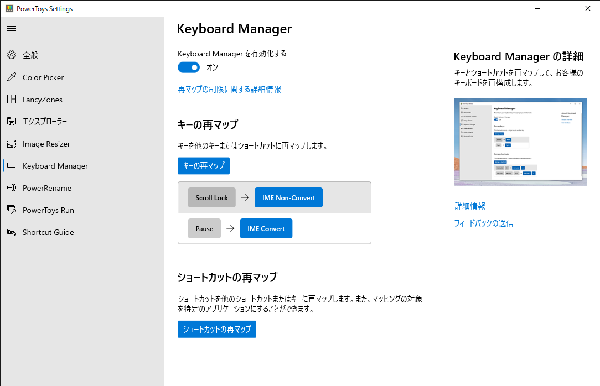  

        - 変更時に「次のキーは割り当てられていないため、使用できません」と  
        ポップアップが表示されるが、実際には適用できている(v0.31.2)  
        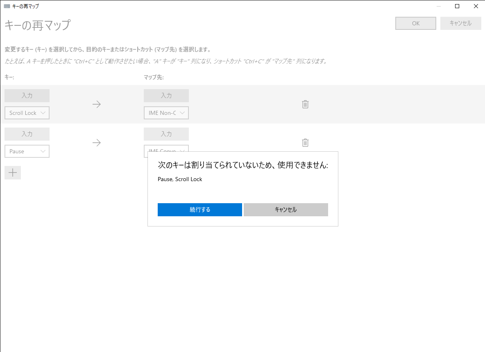 

      - ショートカットの再マップでALT(left)+Space ->[IME Non-Convert] ALT(Right)+Space ->[IME Convert]に設定してみた
        - 2キー必要ならCTRL+Spaceで良い気がしてきた。

    - 拾ってきたメモ書き
    1. PowerToys v0.18以降に搭載のKeyboardManagerでほぼ解決
    左右のキーの単押しをF13以降の何かに振っておく，KeyboardManagerでそれをVK28（変換）とVK29（無変換）にリマップ．
    1. ATOKの設定で変換・無変換をそれぞれIME On/Offに振れば良い．ATOKがF13以降のキーを扱えないばっかりに……

  - AX配列
    - なるべくUS配列を保ったまま日本語入力を目指した配列
      - とっても古いモデルだけど、US配列キーボードでIMEON/OFFするのに今でも使われる手法らしい。(jisの項目参照)

## メンブレン？メカニカル？
  - 参考：https://www.jp.tdk.com/tech-mag/knowledge/094
  - メンブレン  
    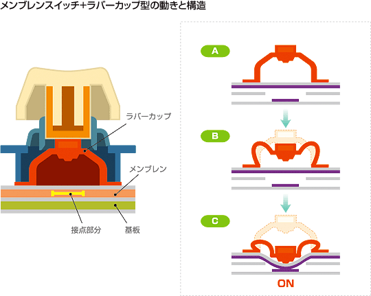 
    - ゴムなので静かに打鍵できる
    - 調べると色々書かれているけどそんなに悪くないと思う。
    - 使っていると、多用するキーが潰れる気がする。CTRLとか特に。※個人の感想

  - パンタグラフ  
    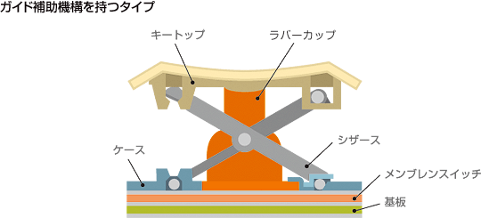 
    - 電車の上についてるアレ、大体のノートパソコンはこれ
    - パチパチという打鍵感は好きな人は好き。自分は割と好き、ただし圧縮配列は駄目だ。  
    カーソルキー多用するのに半分サイズですぐ横にPageUp/Downて地獄か。  
    長年色んな端末乗り換えてきた結果、圧縮配列で場所が移動しやすい  
    右側のCtrlAltShiftがロクに使えなくなってることに気付いた。※個人の感想
    - 他と比べると圧倒的な薄さを実現できるのでこれはこれであり。  
    特にモバイル運用の場合。
    - キー外す度に壊れそうなので掃除は困難  
    衛生面は△
    - 使っていると特定のキーの反応が悪くなる気がする。チャタリング？

  - メカニカル  
    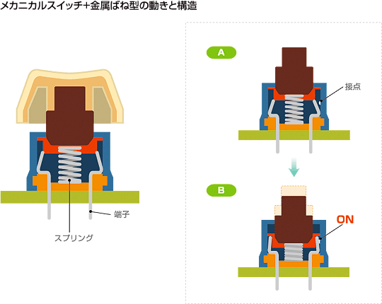 
    - メーカは、Filco、Archiss(アーキス)など色んな所がある。
    - スプリング式スイッチ
    - 割とうるさいので、本人以外には害かもしれない。（茶軸の感想）
    - 打鍵しているときの楽しさは多分これが一番。  
      - 静電容量無接点方式の打鍵感の方が個人的に好きかも。
    - 元メンブレニスト的打鍵していると割と底打ちしている。  
    底打ちをすると打鍵音がうるさくなる＋指への疲労の蓄積が増すので考えた方が良い。

  - 静電容量無接点方式  
    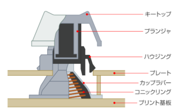 
    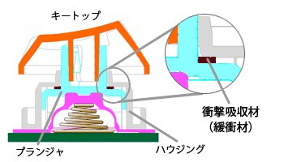
    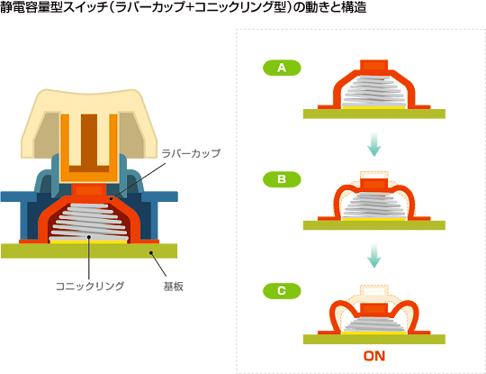  
    - 打鍵の静かさはメンブレンと並ぶ・・か？
    - パンタグラフとメンブレンがメインの時に触らせてもらったけど  
    よくわからんかった。
      - メカニカルでがっつりと打ち込んだ後だとこの感触が良い感じになるようだ。→ なった。かなり良い。
    - メーカはRealforce、Happy Hacking Keyboard、Niz、Leopld
    - HHKBのコンパクトを使っているとハッカー感がでてとってもテンアゲなのかもしれない。  
    ただ、カーソルキーが無いのは辛い。エクセルでセル移動するのにひたすら2キーでカーソル移動とか地獄。

  - メカニカル静電容量  
    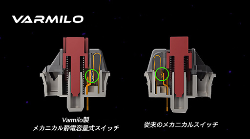 
    - メーカはVarmilo(アミロ)
      - 無限の耐久性って書いてあったけど、実際の所耐久性どうなの？  
      個人の感想を探したけれど見つけられなかったし、  
      静電容量無接点方式と同じような値段になるので微妙かな。

  - 光学式メカニカルキースイッチ  
    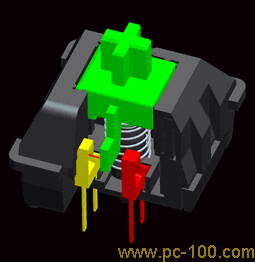  
    - キースイッチ内で常にレーザー？LED？が出ていて、スイッチを押下して光が届くと入力になるらしい  
    - メーカはkeychron https://www.keychron.com/  
    - メカニカルキーボードが好き＋無限の耐久力（）な場合選択肢に上がると思う

## プロファイル
  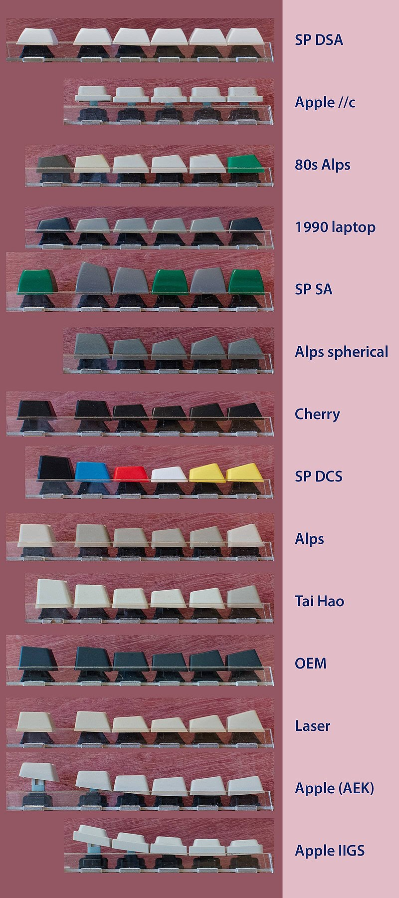
  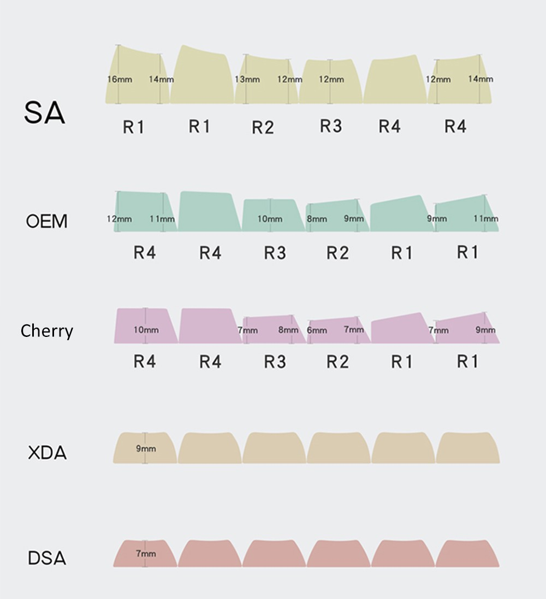  

  - 行によってキーの傾きが違う  
  なのでCapslockとShiftがどちらも2uだとしても  
  タッチ感が変わってくる可能性がある。
    - R1、R2、R3、R4と呼ぶらしいが、  
    上段から呼ぶか下段から呼ぶかが混在しているらしい。酷い。
  - SA > OEM > Cherry > XDA > DAS の順にキーが低くなる
  - https://dosukoi-ichibanboshi.com/niz-plum-keycaps-change01/

## キーキャップ
  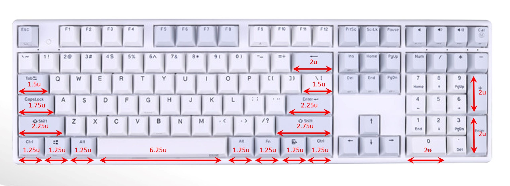  

  - そもそも～uってなんやねん
    - アルファベットの文字キーの大きさの単位らしい  
    文字キーに対してどれくらいサイズが違うよって意味であり  
    文字キーが1uってことらしい。

  | 部位 | micro82,x87,x108 | mini84,plum84 | Atom66,Micro84 |
  |---|---|---|---|
  | Space※ | 6.25u | 5.5u | 4.75u |
  | Shift右 | x | x | 1.75u? |
  | Shift左 | x | x | x |
  | Capslock | 1.75u? | 1.75u? | 1.75u? |
  | Alt | 1.25u? | 1.25u? | 1.25u? |
  | Win | 1u? | 1u? | 1u? |
  - ※スペースの6.25uは一般的なサイズ、5.5uは少ないけど存在、4.75は無い
    - ただし、小さいサイズなら乗せることは可能  
    たとえば、4.75uのmicroに4.5uを乗せることは可能  
    若干の隙間は空くが・・  
     

## メーカ
  - FILCO 

  - NIZ https://www.nizkeyboard.com/
    - 静電容量無接点方式 
    - US配列Only
    - Cherry Mx
    - BlueToothモデルがある
      - BTモデルのバッテリーは満充電保護回路が無い（かもしれない）ので  
      充電しないときは抜いておいた方が良さそう。(2018年モデルだけかも)
    - キーの反応が悪いときは？
      - キャリブレーションしてみるといいよ  
       

  - 東プレ

  - keychron https://www.keychron.com/
    - $100以下で安い
      - 送料が二重で取られる可能性があるっぽい（米国国内配送料＋海外配送料）で結局総額15,000円くらい掛かるんかな。
    - 純正キーマッピングソフトがない？
      > キーの再配置（リマップ）には、Macは「Karabiner」、Windowsは「SharpKeys」が推奨されています。 （マニュアル記載）
      - SharpKeysはレジストリ変更をGUIで行うソフトだった。

## 自作キーボード
  - 沼。
  - DZ60 https://www.nenzop.net/entry/keyboard-dz60-build_log
  - [Gk68](https://ja.aliexpress.com/item/1005001334638194.html?spm=a2g0o.productlist.0.0.533a5376clmUC3&algo_pvid=732612e4-230e-4a27-8f9a-1fd2d433096e&algo_expid=732612e4-230e-4a27-8f9a-1fd2d433096e-1&btsid=0b0a555616165109213215539ea7cb&ws_ab_test=searchweb0_0,searchweb201602_,searchweb201603_)
    - これかなり気になる。  
    hotswap(キースイッチ交換可能式)キーボードがこれ。  
    これに好みのキースイッチ[mx KeySwitchで検索](https://ja.aliexpress.com/wholesale?catId=0&initiative_id=SB_20210323065037&SearchText=mx%E3%80%80keyswitch)とキーキャップ[Cherry keycapで検索](https://ja.aliexpress.com/wholesale?catId=0&initiative_id=SB_20210323065215&SearchText=cherry+keycap)があれば組み立てれるようだ。  
    特にこのGk68というモデルはスペースを3分割して使える(設定できるソフトがあるらしい)ので  
    USキーボードなのに物理的に変換無変換を付与することができるのかもしれない。  
    期待。

## メモ
  - band aid mod
    - 静音目的でバンドエイドのガーゼが無い所をスタビライザーの下に貼り付けるらしい  
    スタビライザーを一度外さないとできないのでよほどのことがない限りやりたくない。
  - スタビライザーにルブを塗る
    - やっぱりこれも静音目的。  
    band aid modと違いキートップを外せば実施できるの現実的。  
    ただ静音と引き換えにゴミを吸着しやすくする諸刃の剣。
  - スペースキーを逆さまに装着する
    - 親指キーの入力を楽にする目的で、親指で押下するキーを逆さまに装着する。  
    たしかに親指での押下が楽になったので有用と思われる。  
    パームレストなしの状態で確認しているため、パームレストを使うと今度は低すぎて入力し難いかもしれない。 
    (追記)パームレストありの状態で2週間くらい運用してみたが、大変快適なのでスペースキーを逆さまはおススメ。
    http://oookaworks.seesaa.net/article/449130799.html#gsc.tab=0  
    https://watchmono.com/blog-entry-4349.html
  - パームレスト  
  ノートPC本体キーボードからキーボードに変更する場合パームレストは必須と思われる。  
  詳しくは[ここ](https://salicylic-acid3.hatenablog.com/entry/diy-palm-rest)が分かりやすく説明してくれている。  
  後、[アリエクで安く売ってる](https://ja.aliexpress.com/item/1005001688680955.html)のでとりあえず買っとくといいかも。  
  参考：2021/03月購入時でx87サイズ 1500円くらい

---
2021/02/19～
