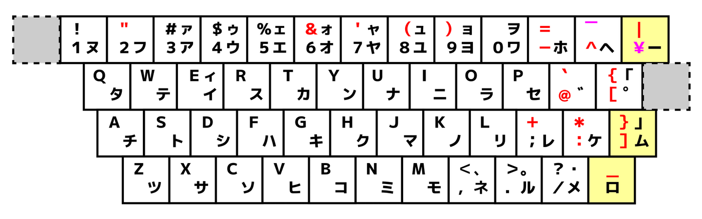
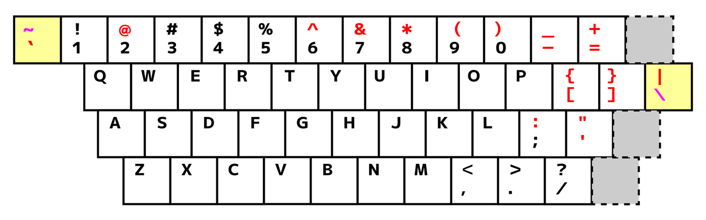
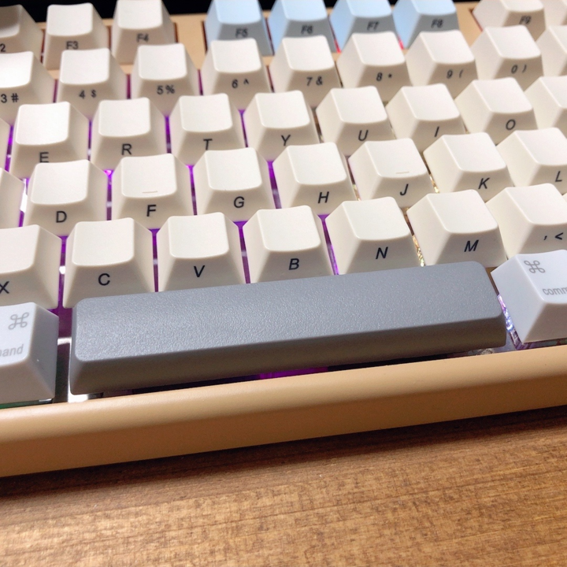
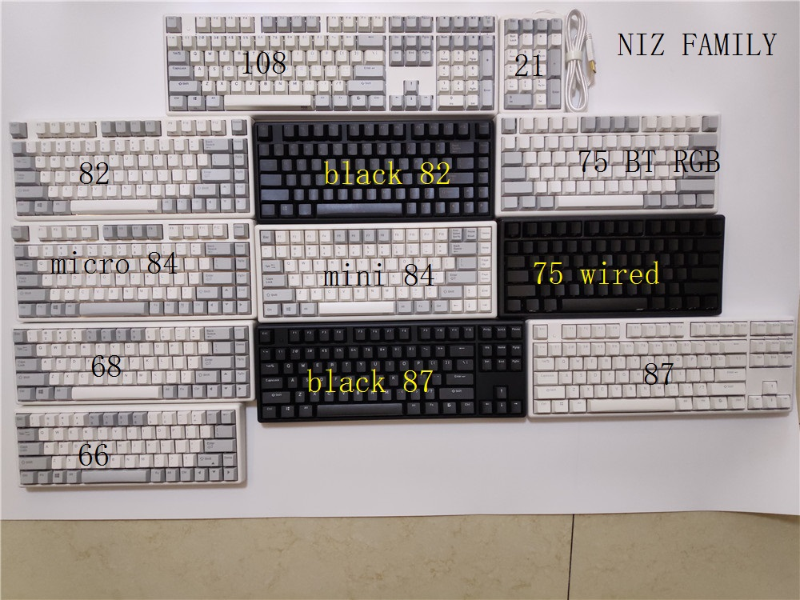

# キーボード

## まとめ
  - US配列キーボードをWIN環境で使う場合
    - レジストリを変更する必要あり。
    - ソフト導入可能な場合、alt-ime-ahkを導入することで左右ALTをIMEOn/Offにできる
    https://github.com/karakaram/alt-ime-ahk/releases
      - またはAutoHotKeyでなんかそれっぽく置換する作戦が良いと思う
    - 不可である場合、Alt + ` か Ctrl＋Spaceでトグルできる（半角/全角キー同等）

## US?JIS?
  
  - JIS配列
    - どの作業場所行っても大体これ  
    調べると、大手になればUSとJISの選択式の所もあるらしい・・  

  - US配列
    
    - Linuxのコマンドやプログラム書くにはこちらの方が優れているらしい
    - ノートパソコンはJIS配列、キーボードはUS配列にすると  
    ノートパソコン単体だと入力記号が不一致になってしまい困るよ。
      - 大丈夫。分けれるらしい。  
    
    - US配列をAX配列を認識させて、変換/無変換キー  
    https://cero-t.hatenadiary.jp/entry/20181125/1543139308  
    https://uchanote.blogspot.com/2015/08/us-ime-onoff.html 
    https://technote.flyingjunk.net/786/   
    https://qiita.com/Big/items/c97573965804fb21ff9e  
    https://answers.microsoft.com/ja-jp/windows/forum/windows_10-ime/windows10-%E3%81%A7%E3%81%AE-ax/f5eda1d5-606b-4c9b-9868-fb34e52cbafc  
    ただ、レジストリの書き換えが必要なので現場ではとてもできないだろう。。

  - AX配列
    - なるべくUS配列を保ったまま日本語入力を目指した配列
      - とってもモデルのようですが、  
      US配列キーボードでIMEON/OFFするのに今でも使われる手法のようです。

## メンブレン？メカニカル？
  - メンブレン
  - パンタグラフ
  - メカニカル
    - Filco、Archiss(アーキス)
  - 静電容量無接点方式
    - Realforce、Happy Hacking Keyboard、Niz、Leopld
  - 静電容量メカニカル
    - Varmilo(アミロ)
      - 耐久性どうなの？

## プロファイル
  - 行によってキーの傾きが違う  
  なのでCapslockとShiftがどちらも2uだとしても  
  タッチ感が変わってくる可能性がある。
    - R1、R2、R3、R4と呼ぶらしいが、  
    上段から呼ぶか下段から呼ぶかが混在しているらしい。酷い。
  - SA > OEM > Cherry > XDA > DAS の順にキーが低くなる

## キーキャップ

  | 部位 | micro82,x87,x108 | mini84,plum84 | Atom66,Micro84 |
  |---|---|---|---|
  | Space※ | 6.25u | 5.5u | 4.75u |
  | Shift右 | x | x | 2u？1.75u？ |
  | Capslock | 2u | 2u | 2u |
  | Alt,Win | 1.5u | x | x |

  - そもそも～uってなんやねん
    - アルファベットの文字キーの大きさの単位らしい  
    文字キーに対してどれくらいサイズが違うよって意味であり  
    文字キーが1uってことらしい。

  - ※スペースの6.25uは一般的なサイズ、5.5uは少ないけど存在、4.75は無い
    - ただし、小さいサイズなら乗せることは可能  
    たとえば、4.75uのmicroに4.5uを乗せることは可能  
    若干の隙間は空くが・・  
    

## メーカ
  - FILCO 

  - NIZ
    - 静電容量無接点方式 
    - US配列Only
    - Cherry Mx
    - BlueToothモデルがある
      - BTモデルのバッテリーは満充電保護回路が無い（かもしれない）ので  
      充電しないときは抜いておいた方が良さそう。(2018年モデルだけかも)
    - キーの反応が悪いときは？
      - キャリブレーションしてみるといいよ
    

  - 東プレ

## 自作キーボード
  - 沼。

## メモ
  - band aid mod
    - 静音目的でバンドエイドのガーゼが無い所をスタビライザーの下に貼り付けるらしい
  - スタビライザーにルブを塗る
    - やっぱりこれも静音目的。

---
2021/02/19～
