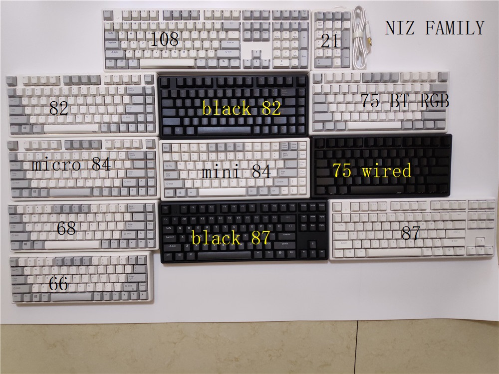
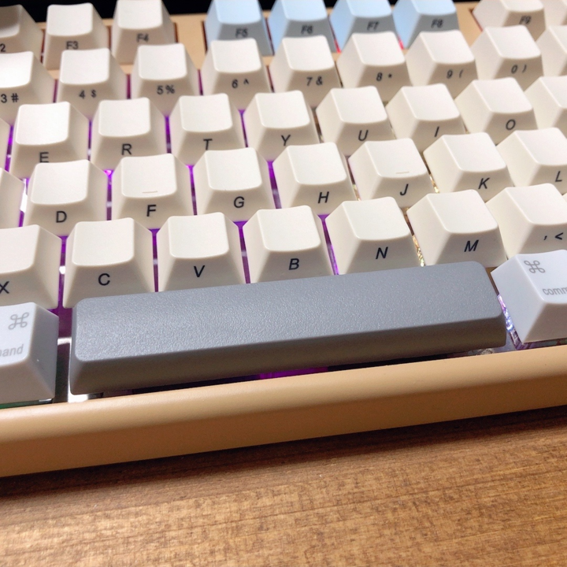

# キーボード

## US?JIS?
  - 

## FILCO 

## NIZ

  - 英語キーボードしかない

  - キーキャップ  
    | 部位 | micro82,x87,x108 | mini84,plum84 | Atom66,Micro84 |
    |---|---|---|---|
    | Space | 6.25U:〇 | 5.5u:△ | 4.75u:× |
    | Shift右 | x | x | 2u |
    | Capslock | 2u | 2u | 2u |
    | Alt,Win | 1.5u | x | x |

    - 6.25uは一般的なサイズ、5.5uは少ないけど存在、4.75は無い
      - ただし、小さいサイズなら乗せることは可能  
      たとえば、4.75uのmicroに4.5uを乗せることは可能  
      若干の隙間は空くが・・
      
    
    - そもそも～uってなんやねん
      - アルファベットの文字キーの大きさの単位らしい  
      文字キーに対してどれくらいサイズが違うよって意味であり  
      文字キーが1uってことらしい。
    
    - プロファイル
      行によってキーの傾きが違うものがある  
      なのでCapslockとShiftがどちらも2uだとしても  
      タッチ感が変わってくる可能性がある。
        - どう調べるのか分からんのでとりあえず放置

## 東プレ