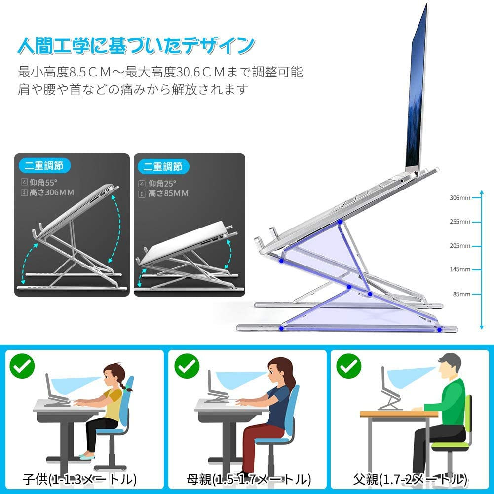
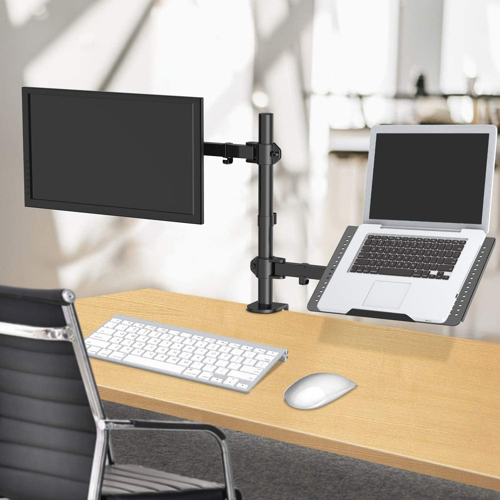

# 開発環境
  - 物理的な開発環境について調査

## ノートパソコン
  - 本体
  - ノートパソコンスタンド
    - 持ち運ぶなら
      - [これ！](https://www.amazon.co.jp/dp/B087P8T8WC/)  
      
        - 高さと角度が調整できるもの 
        - 折りたたんだ時に小型となる
        - 机の上にそれなりのスペースが必要
        - ノートパソコンをひっかける爪のところにクッションを入れないと端末が閉じれない場合があるので設置後は閉じれるか確認すること。
    - 据置なら
      - [これ！](https://www.amazon.co.jp/dp/B087J9W6NB/)  
      
        - 持ち運べるタイプと比べて省スペースで画面の下も有効に使える

## ディスプレイ
  - ノートPCのサブに使うなら21インチ程度が良いのではないか
    - [例えば（送料込み9980円）](https://jp.ext.hp.com/monitors/personal/kakaku/?jumpid=st_cn_p_af_kkc)
      - って書いたけど、その値段の商品なかったわ。

## サブディスプレイ
  - 僕のノートPCはHDMIポートが一つある。
    - ディスプレイ2枚では不足しているので3枚目が欲しい
      - 仮想デスクトップを使うことで2枚でもなんとなく良い感じになったが、コードの数を減らしたいので考えたい。
    - 方法としてはUSB外部ディスプレイ、ワイヤレス接続くらいか？
      - https://it-sora.net/archives/6981

  - Miracast
    - 「Miracast」でWin10をサブディスプレイ化できるようだ
      - Winタブ(Win10Home)ならいけるか？
        - 2台中1台が接続先に出てこない、謎
        - 当然ながらこのディスプレイは表示処理が遅い  
          なので、使うなら動きの少ないものが望ましい。
        - 使ってたら接続が不安定になってメイン画面巻き込んで落ちた。これは不安。
      - サーフェスRT8.1なのでNG
        - 眠ってた端末なのでこれが使えると〇なんだが
      - Androidタブは論外
    - 「mouse without borders」というソフトで実現可能とのこと
      - Winタブ(Win10Home)はMiracastが使えたので試してない
      - RT8.1には該当のソフト導入できなかった。
      - Androidはタブ論外
    
  - USB-Cハブ
    - hdmiポートがあるものを使えば実現できそう
      - ハブとディスプレイを増設する必要あり。
    - Type-Cで接続できるディスプレイもあるらしいので調査する

## 無線LAN
  - 自宅で使うなら正直なんでもいい
    - TP-LINKという中華を利用している。
      - 久しぶりに調べたらアンテナ10本くらい映えてるのあったが  
      3本あれば十分事足りるだろう。

## 通話
  - 据置マイクならマランツプロ
    - https://www.amazon.co.jp/dp/B01GJ9IUNY/
    - ポップガードを用意するとより良い
      - ポップガードというのはマイクの前に網を設置して破裂音を軽減するためのものらしい
      - 自作することもできるので機会があったら試したい。
    - 音声を整えるならばミキサーがあると良い
  - 動くならピンマイク型
  - BT式のならTE-D01gvが割と良い
    - 片耳で試用可能(ただし片方なくすとペアリング切り替えが絶望的)
    - 10時間くらい持つ&本体格納すれば数倍長持ちする

## キーボード
  - キーボードは書くことがおおいので別ページ。

## マウス
  - 持ち運ぶなら普通のマウス、据置ならトラックボールが良いと思う
    - トラックボールを15年くらい使っているがとても楽
      - 今ならケンジントンのスリムブレードかExpert Mouse ワイヤレス トラックボール
        - 後者はワイヤレスなのでケーブル整理に良いだろう。
      - エレコムのHUGE、DEFT Proあたりが良いだろう。
      - これらは全て人差し指モデルだが、個人的に人差し指モデルが好きなだけなので自分に合ったものを選ぼう。
      - トラックボールはでかいモデルが使いやすいが  
      でかいと当然持ち運びには向かない。
    - マウスはロジクールのM590がとても良い
      - クリックのカチカチ音がしない静音モデル
      - 電池で使えてかつ長持ち
      - BTなのでポートを占領しない

---
2021/02/19～