# LINE

## やりたいこと 
```
1. LINE Messaging APIで画像付きメッセージを送る
2. 画像クリックでWEBサービスのページにリンク
3. リンクのパラメータにLINE IDを付与したい
4. PowerPlatform の Power Virtual AgentsでBOTを作りたい
5. どうやってつなぐ？
``` 
  - つまり、ユーザからメッセージが来る＞返信で画像付きメッセージ送る＞クリックすると誰が(userId)リンクを踏んだのかが分かるようにしたい。

## 調査
> 1. LINE Messaging APIで画像付きメッセージを送る
> 2. 画像クリックでWEBサービスのページにリンク
- [LINE Messaging API メッセージタイプ](https://developers.line.biz/ja/docs/messaging-api/message-types/#template-messages)
  - イメージマップメッセージが理想に近いらしい  
  
  - このページが参考になると思われる。  
  [LINE Messaging APIリファレンス イメージマップメッセージ](https://developers.line.biz/ja/reference/messaging-api/#imagemap-message)  
  使い方は、「2つのタップ領域を持つイメージマップメッセージの例」のJSONコードを見たら良さそう
    - actions
      画像がタップされた時のアクション

> 3. リンクのパラメータにLINE IDを付与したい
  - [LINE Messaging APIリファレンス Webhookイベントオブジェクト](https://developers.line.biz/ja/reference/messaging-api/#webhook-event-objects)
    - これを読む限りPOSTデータの中にユーザ情報が含まれているっぽい
    - displayNameがユーザの表示名  
    userIdがユーザID

    - https://developers.line.biz/
    - https://manager.line.biz/


> 4. PowerPlatform の Power Virtual AgentsでBOTを作りたい
  - [参考：ノーコードでLINE Botを作って資産管理を行ってみる](https://speakerdeck.com/rnakamuramartiny/falsekododeline-botwozuo-tutezi-chan-guan-li-woxing-tutemiru)
  - [PowerVirtualAgents](https://powerva.microsoft.com/)
    - M365ログインが必要
    - 無料試用版を使うをOK
      - 実際に使う際には、「ユーザごとのライセンス」「テナントライセンス」が必要  
      料金は「セッション」単位で求められるらしい  
      [参考：【Microsoft Power Platform】Power Virtual Agentsについて](https://qiita.com/kento_gm/items/bc7f17cb598545297f63)
      - 1テナント2000セッションまで$1000/月
    - 試しに使ってみる
      - [PowerVirtualAgents](https://powerva.microsoft.com/)
      - ログインしたらいきなりbot作成と出る  
      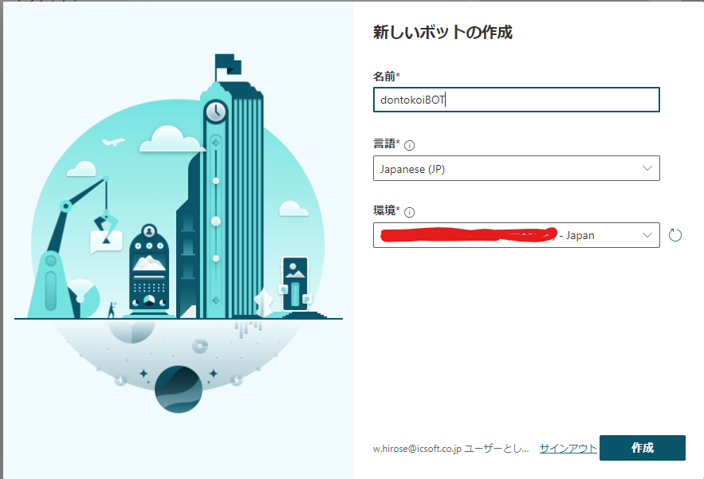
      - 入力してしばらく待つとBOTが作成され、トップ画面が表示される  
      トップ画面でチャットを試せる  
      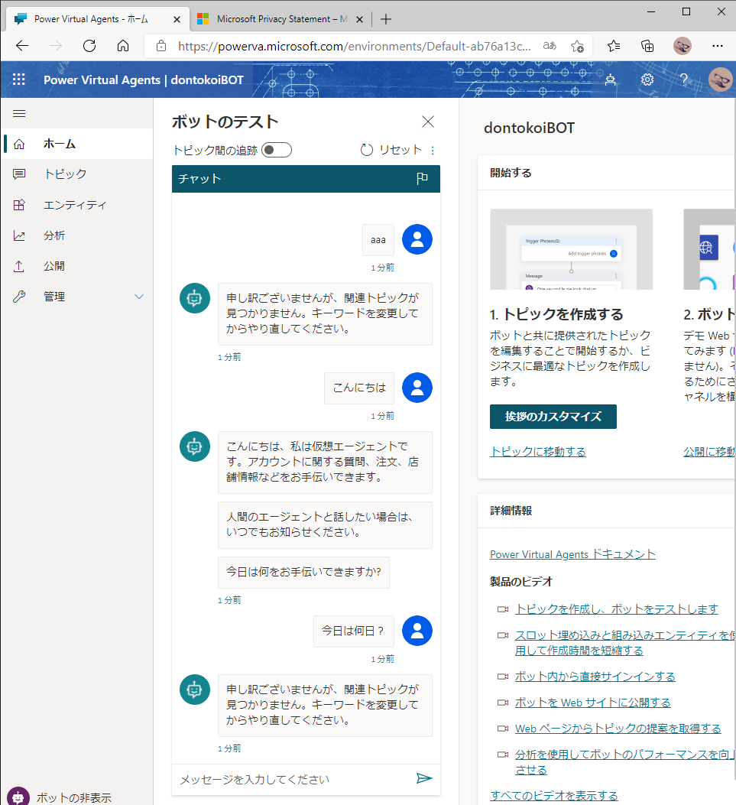
    - 左ペイントピック＞新しいトピックで以下を設定し、キャンパスの作成に移動
      - トピック名：一覧に表示する名前
      - フレンドリ名：外部向けの名称？
      - 説明：トピックの説明
      - トリガーフレーズ：botが認識する文言を入れる  
      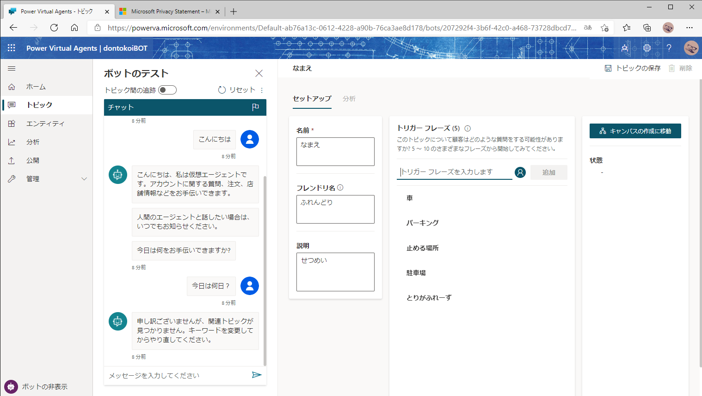
      - キャンパスの編集でどんな会話を行うか設定できる  
      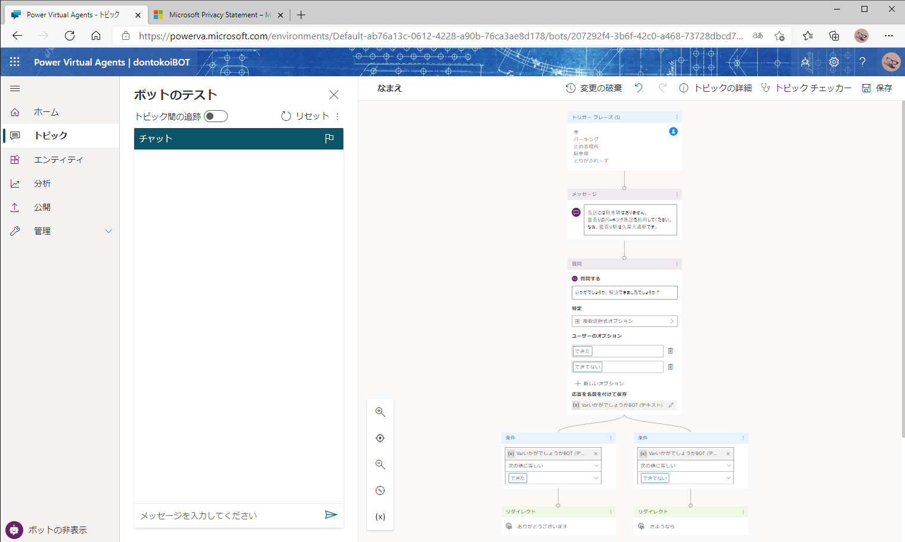

      - 左ペイン公開＞公開をクリックで1分後に使えるようになるらしい  
      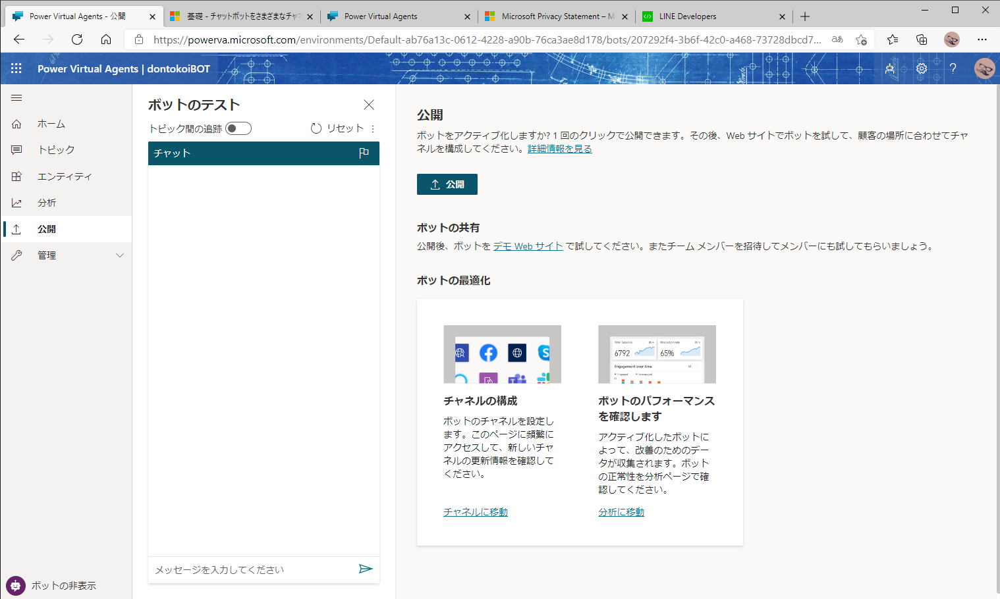
        - デモwebサイトで動作確認ができる  
        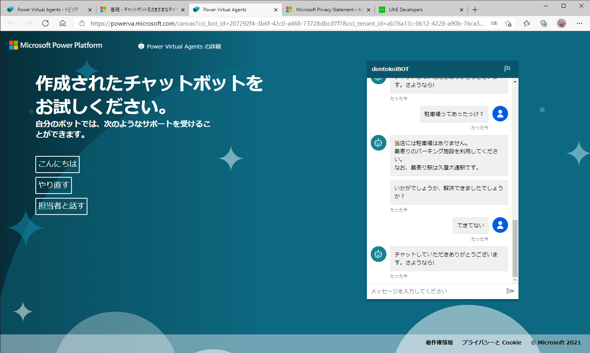
      - 公開後に左ペインの管理＞チャネル＞LINEでIDを取得できる  
      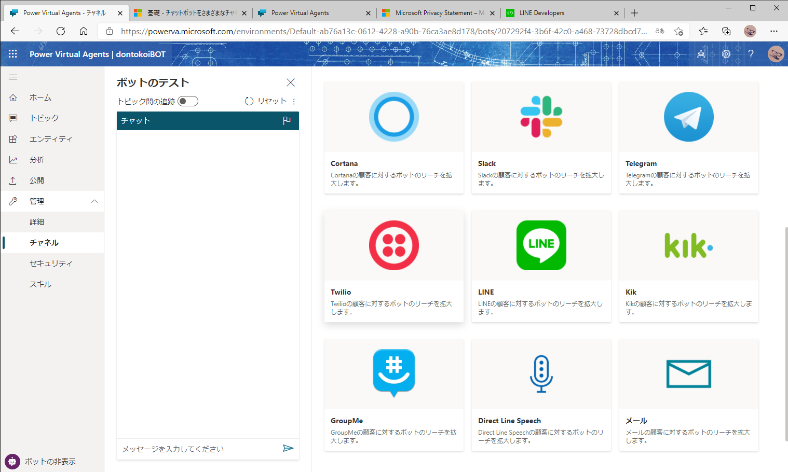
      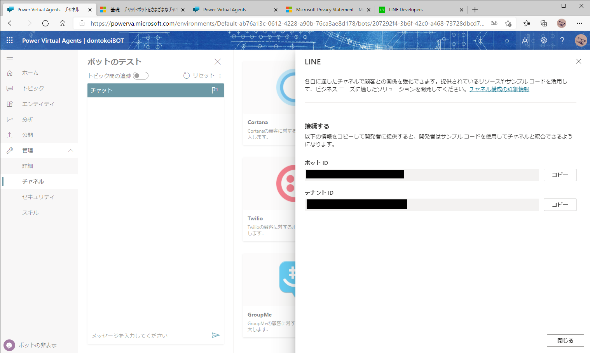

> 5. どうやってつなぐ？
  - 流れはこんな感じ  
  Power Virtual Agents <-中継bot-> Azure Bot Service <-webhook-> LINE
    - Power Virtual Agents
      - ここでbotの会話を作成する
      - 管理＞チャネル＞LINEでボットID/テナントIDをメモ
      - 中継bot(Azure Bot Service)
        - PowerVirtualAgentsで取得したボットID/テナントIDを入力する
        - まだ使い方分からない
      - Azure Bot Service
        - [参考：Power Virtual Agents ボットを Azure Bot Service チャネルに追加する](https://docs.microsoft.com/ja-jp/power-virtual-agents/publication-connect-bot-to-azure-bot-service-channels)
    - Azure Bot Service
      - webhookのURLをメモ
        - webhook
      - LINEのチャンネルシークレット、チャンネルアクセストークンを入力
        - まだ繋がってない・・  
        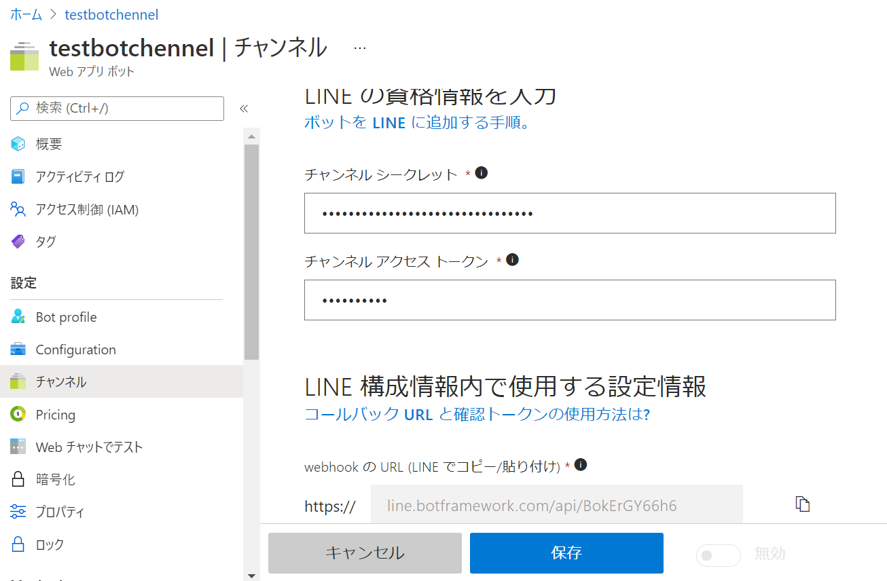
    - LINE
      - チャンネルシークレット、チャンネルアクセストークンをメモ
        - チャンネルシークレット  
        チャンネル基本設定の真ん中のあたり
        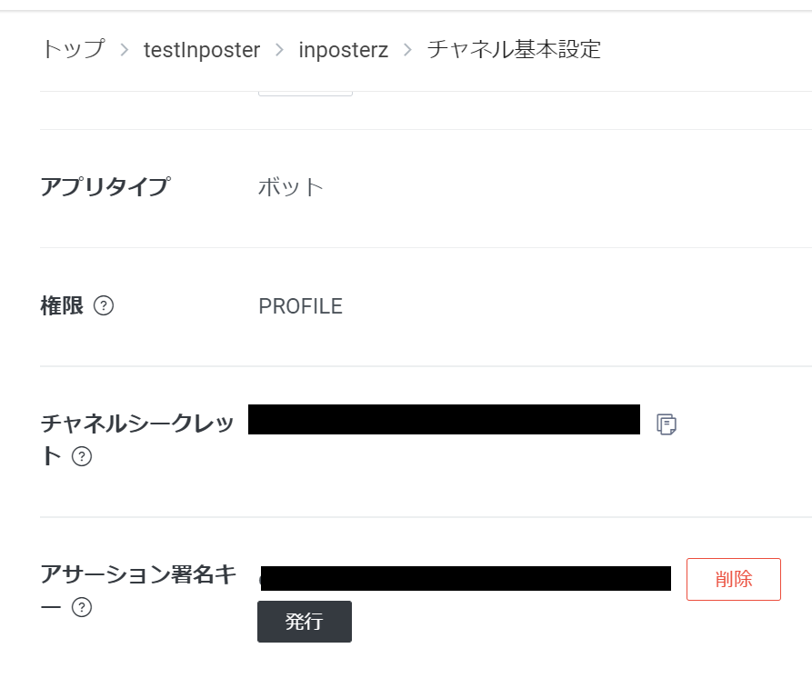
        - チャンネルアクセストークン  
        Messaging API設定の下の方
        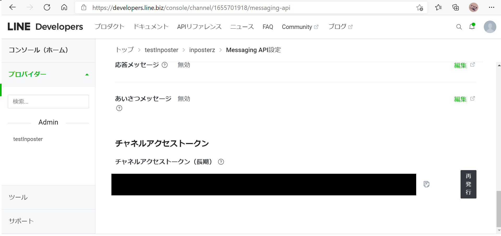
      - webhookのurlを入力する。
        - 検証で接続できるかが確認できる。
          - 失敗する。  
          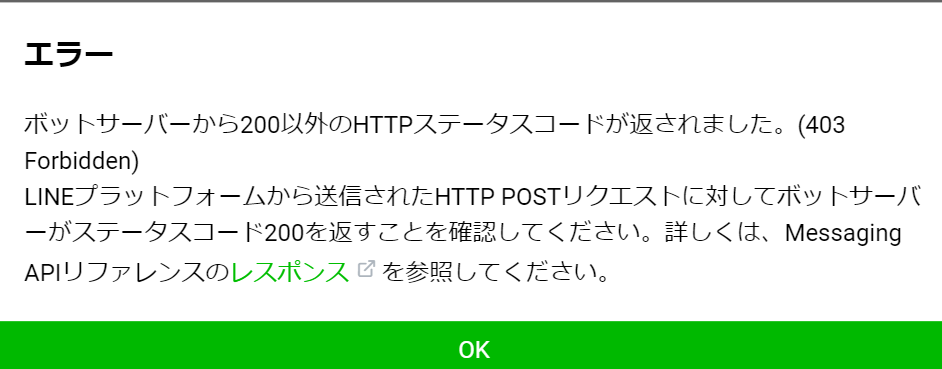
          - チャンネルシークレット、アクセストークンを適切に設定したら成功した。

  - Azure Bot Serviceの準備  
  [参考](https://qiita.com/annie/items/1926fc16731fcaad0666)  
    - azure portal上でweb app botと検索し、導入  
    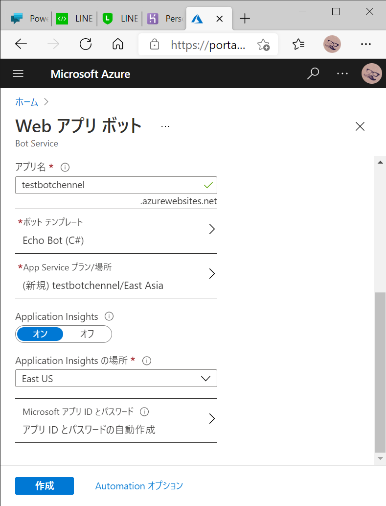
    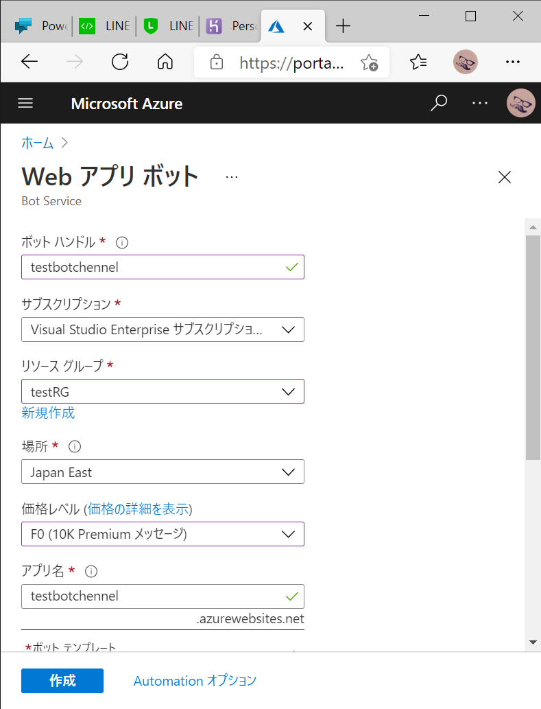
    - LINEのチャンネルシークレット、チャンネルアクセストークンを入力  
    


  

  