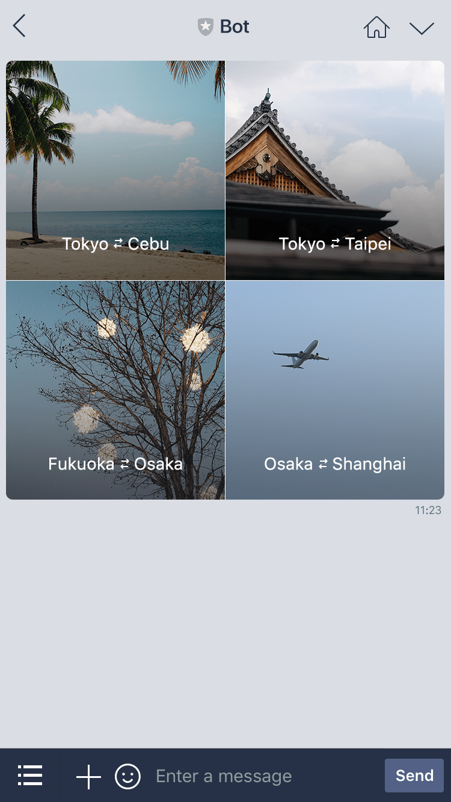

# LINE

## やりたいこと 
```
1. LINE Messaging APIで画像付きメッセージを送る
2. 画像クリックでWEBサービスのページにリンク
3. リンクのパラメータにLINE IDを付与したい
``` 
  - つまり、誰がリンク踏んだのかを調べれるようにしたい

## 調査
> 1. LINE Messaging APIで画像付きメッセージを送る
> 2. 画像クリックでWEBサービスのページにリンク
- https://developers.line.biz/ja/docs/messaging-api/message-types/#template-messages
  - イメージマップメッセージが理想に近いらしい  
  
  - https://developers.line.biz/ja/reference/messaging-api/#imagemap-message
  - このページが参考になると思われる。  
  使い方は・・「2つのタップ領域を持つイメージマップメッセージの例」のJSONコードを見たら良さそう
    - actions
      画像がタップされた時のアクション

> 3. リンクのパラメータにLINE IDを付与したい
  - https://developers.line.biz/ja/reference/messaging-api/#webhook-event-objects
    - これを読む限りPOSTデータの中にユーザ情報が含まれているっぽい
    - displayNameがユーザの表示名  
    userIdがユーザID
  - 


  

  